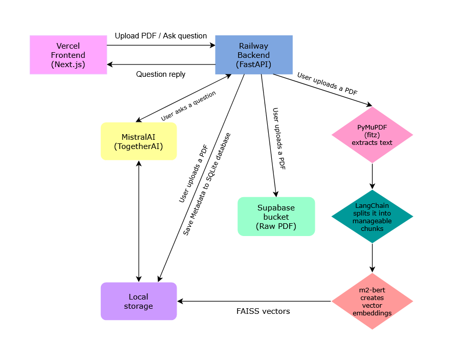

## AI Planet Full-Stack Internship Assignment

This project was developed as part of the Full-Stack Engineer Internship Assignment for AI Planet during April 25–28, 2025.

***[Live Demo](https://pd-fhelper.vercel.app/)***


- Frontend:
  - **Next.js** (React 18 App Router), Tailwind CSS, React Query
- Backend:
  - **FastAPI** for API endpoints and cross-origin interaction
- Database:
  - PDFs stored securely in **Supabase** buckets
  - **SQLite** database for metadata
  - Local storage for **FAISS** vector indices
- NLP and Retrieval:
  - LangChain and LlamaIndex for context retrieval
- Embedding Model:
  - togethercomputer/**m2-bert-80M-32k-retrieval** (Together AI API)
- LLM Model:
  - mistralai/**Mixtral-8x7B-Instruct-v0.1** (Together AI API)




### Backend Architecture
- FastAPI Endpoints:
    - **/upload**: Upload PDF documents, save to Supabase Storage, and index locally.
    - **/ask**: Submit questions and receive streamed answers.
- PDF Processing:
    - Extract text using **PyMuPDF**.
    - Store temporary vectors using **FAISS**.
- NLP Handling:
    - **LangChain and LlamaIndex** manage context retrieval and LLM interaction.


### Frontend Architecture
- Next.js App Router based pages and layouts
- **React Query** for robust asynchronous API handling
- Tailwind CSS for responsive and clean UI
- Error Handling: Client-side notifications for upload or server failures

### Setup Instructions

#### 1. Clone the Repository

```bash
git clone https://github.com/ArshanKaudinya/PDFhelper
cd PDFhelper
```
#### 2. Environment Variables

Create a .env file inside the backend folder with the following:

```plaintext
SUPABASE_URL=your_supabase_url
SUPABASE_ANON_KEY=your_supabase_anon_key
OPENAI_API_KEY=your_together_ai_token
```
Create a .env.local file inside the frontend folder with:
```plaintext
NEXT_PUBLIC_SUPABASE_URL=your_supabase_url
NEXT_PUBLIC_SUPABASE_ANON_KEY=your_supabase_anon_key
NEXT_PUBLIC_BACKEND_URL=http://localhost:8000
```
(Replace localhost:8000 if backend hosted elsewhere.)

#### 3. Install Dependencies
##### Backend
```bash
cd backend
python -m venv .venv
source .venv/bin/activate  # or .venv\Scripts\activate on Windows
pip install -r requirements.txt
```
#### 4. Run Locally
##### Backend
```bash
cd backend
uvicorn app.main:app --reload
```
##### Frontend
```bash
cd frontend
pnpm dev
# or
npm run dev
```
### Deployment
- Frontend deployed on **[Vercel](https://pd-fhelper.vercel.app/)**
- Backend hosted on **Railway**
- Storage handled by **Supabase** buckets


### Key Features
- Upload PDFs directly from your browser
- Embeddings are generated and stored locally
- Ask natural questions about uploaded PDFs
- Search within chat by keywords
- Fully responsive design with mobile support


### Functional Overview
1. Upload a PDF document.
2. Ask any question related to the uploaded document.
3. Receive concise and accurate answers powered by the Mixtral LLM.
4. Search across previous conversation messages.